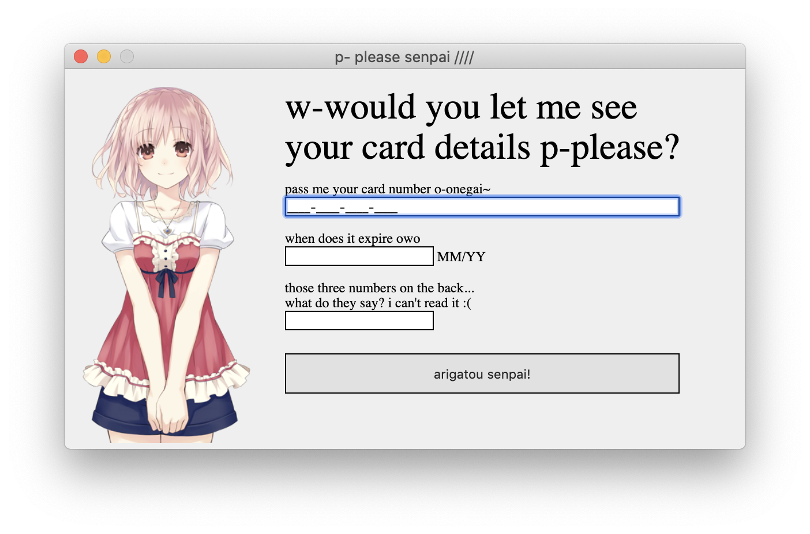

# nothing of value



This is a boilerplate attempt at making my first electron application. Just a mere 130 megabytes for a joke application. SIGN ME UP *!!*


## running

```bash
npm start
```


## package

for windows: `npm run publish:win`

for mac: `npm run publish:osx`


No, it doesn't actually collect any cc data. That's a joke.
